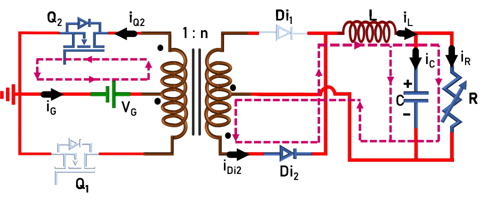

### Theory

The circuit diagram of push-pull converter is given in Fig. 1.

  
  
Fig. 1. Circuit Diagram of Push-pull Converter.

 
The switches (Q1 and Q2: ON/OFF-state) are turned-ON/OFF using 180o phase shifted PWM signals. The converter operation can easily be understood from the following equivalent circuits. Brief mathematical analysis is given below.
  

<table border="0" align="center" style="width:100%; border:none;">
  <tr>
<td style="width:50%">

  
Fig. 2(a). Circuit in mode-I (Q1- ON, Q2- OFF).
  

</td>
<td style="width:50%">
  

  
Fig. 2(b). Circuit in mode-II, IV (Q1- OFF, Q2- OFF).
  

 
    </td>
  </tr>

<tr>
  <td colspan="2">
    

  
Fig. 2(c). Circuit in mode-III (Q1- OFF, Q2- ON).
  

  </td>
</tr>
</table>
  

 
  
  **1. Voltage conversion ratio or voltage gain (M)**
 
Voltage across inductor L:
 

  
Since the frequency of inductor current/voltage is ‘TS/2’, only Mode-I and Mode-II or Mode-III and Mode-IV is sufficient to formulate the voltage gain:
  

**Mode – I :**
 

  

    ..(1)

  

 
  
  where n=Ns/Np.
 

**Mode – II :**
 

  
      

    ..(2)
      
     
  

 
  
  Applying ‘volt-sec’ balance across the inductor (eqn. 1 and 2)
 

  
      

    ..(3)

  

 
  
  Solving eqn. 3 gives,
 

  
      

    ..(4)
   
      

 

 
  
  **2. Average current through the inductor:**
 
Current through capacitor C:
 

  
Since the frequency of both the inductor and capacitor currents is ‘TS/2’, only Mode-I and Mode-II is considered.
  

**Mode – I :**
 

  

    ..(5)

  

 
  
  &nbsp;
 

**Mode – II :**
 

  
      

    ..(6)
      
     
  

 
  
  Applying ‘Charge-sec’ balance to the capacitor (eqn. 5 and 6)
 

  
      

    ..(7)

  

 
  
  Solving eqn. 7 gives,
 

  
      

    ..(8)
   
      

  

 
  
  Therefore, average inductor current is equal to load current.
 

 

 
  
  **3. Power balance under ideal condition (neglecting losses in the converter):**

  
In ideal conditions, the input power is equal to the output power. Hence,
  

 

  

    ..(9)

  

 
  
  &nbsp;
 

  
      

    ..(10)
      
     
  

 
  
  Substituting eqn. 4 in 10,
 

  
      

    ..(11)

  

 
