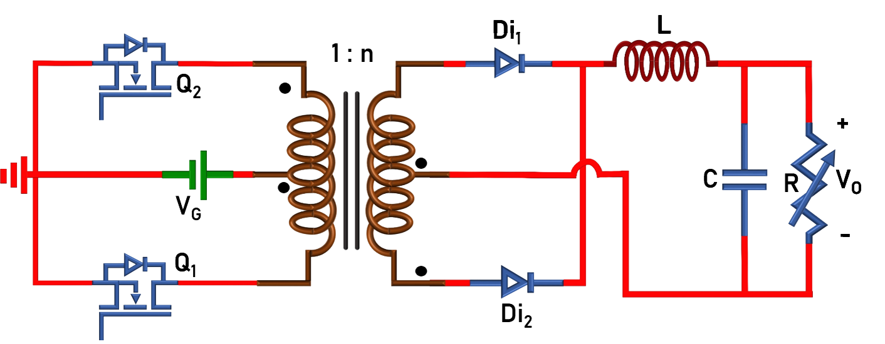
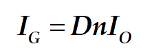

### Theory

The circuit diagram of push-pull converter is given in Fig. 1.

  
  
Fig. 1. Circuit Diagram of Push-pull Converter.

 
The switches (Q1 and Q2: ON/OFF-state) are turned-ON/OFF using 180o phase shifted PWM signals. The converter operation can easily be understood from the following equivalent circuits. Brief mathematical analysis is given below.
  

<table border="0" align="center" style="width:100%; border:none;">
  <tr>
<td style="width:50%">

  
Fig. 2(a). Circuit in mode-I (Q1- ON, Q2- OFF).
  

</td>
<td style="width:50%">
  

  
Fig. 2(b). Circuit in mode-II, IV (Q1- OFF, Q2- OFF).
  

 
    </td>
  </tr>

<tr>
  <td colspan="2">
    

  
Fig. 2(c). Circuit in mode-III (Q1- OFF, Q2- ON).
  

  </td>
</tr>
</table>
  

 
  
  **1. Voltage conversion ratio or voltage gain (M)**
 
Voltage across inductor L:
 

  
Since the frequency of inductor current/voltage is ‘TS/2’, only Mode-I and Mode-II or Mode-III and Mode-IV is sufficient to formulate the voltage gain:
  

**Mode – I :**
 

  

    ..(1)

  

 
  
  where n=Ns/Np.
 

**Mode – II :**
 

  
      

    ..(2)
      
     
  

 
  
  Applying ‘volt-sec’ balance across the inductor (eqn. 1 and 2)
 

  
      

    ..(3)

  

 
  
  Solving eqn. 3 gives,
 

  
      

    ..(4)
   
      

 

 
  
  **2. Average current through the inductor:**
 
Current through capacitor C:
 

  
Since the frequency of both the inductor and capacitor currents is ‘TS/2’, only Mode-I and Mode-II is considered.
  

**Mode – I :**
 

  

    ..(5)

  

 
  
  &nbsp;
 

**Mode – II :**
 

  
      

    ..(6)
      
     
  

 
  
  Applying ‘Charge-sec’ balance to the capacitor (eqn. 5 and 6)
 

  
      

    ..(7)

  

 
  
  Solving eqn. 7 gives,
 

  
      

    ..(8)
   
      

  

 
  
  Therefore, average inductor current is equal to load current.
 

 

 
  
  **3. Power balance under ideal condition (neglecting losses in the converter):**

  
In ideal conditions, the input power is equal to the output power. Hence,
  

 

  

    ..(9)

  

 
  
  &nbsp;
 

  
      

    ..(10)
      
     
  

 
  
  Substituting eqn. 4 in 10,
 

  
      

    ..(11)

  

 

 
  
  **4. Inductor current ripple:**
  
From eqn. 1,
  

 

  

    ..(12)

  

 
  
  &nbsp;
 

  
      

    ..(13)
      
     
  

 
  
  Therefore, the inductor ripple current is,
 

  
      

    ..(14)

  

 
  
  **5. Current through various components:**
  
The current through various components can easily be identified from Fig. 3.
  

 

  
  
Fig. 3. Circuit Diagram of Push-pull Converter.

 

<table align="center" width="100%" >
  <tr style="text-align: center; font-weight: bold; background-color: #c9c9c9;">
    <td style="text-align: center; font-weight: bold;">&nbsp;</td>
    <td style="text-align: center; font-weight: bold;" colspan="2">
      Mode-I (DTs/2)
    </td>
    <td style="text-align: center; font-weight: bold;" colspan="2">
      Mode-II (1-D)Ts
    </td>
    <td style="text-align: center; font-weight: bold;" colspan="2">
      Mode-III (DTs/2)
    </td>
    <td style="text-align: center; font-weight: bold;">Average Current</td>
  </tr>
  <tr style="background-color: #c9c9c9;">
    <td></td>
    <td>imin</td>
    <td>imax</td>
    <td>imin</td>
    <td>imax</td>
    <td>imin</td>
    <td>imax</td>
    <td>Iavg</td>
  </tr>
  <tr style="background-color: #FFF;">
    <td>iL</td>
    <td></td>
    <td></td>
    <td></td>
    <td></td>
    <td></td>
    <td></td>
    <td></td>
  </tr>
  <tr style="background-color: #FFF;">
    <td>iC</td>
    <td></td>
    <td></td>
    <td></td>
    <td></td>
    <td></td>
    <td></td>
    <td>&#48;</td>
  </tr>
  <tr style="background-color: #FFF;">
    <td>iQ1</td>
    <td></td>
    <td></td>
    <td>&#x30;</td>
    <td>&#x30;</td>
    <td>&#x30;</td>
    <td>&#x30;</td>
    <td></td>
  </tr>
  <tr style="background-color: #FFF;">
    <td>iQ2</td>
    <td>&#x30;</td>
    <td>&#x30;</td>
    <td>&#x30;</td>
    <td>&#x30;</td>
    <td></td>
    <td></td>
    <td></td>
  </tr>
  <tr style="background-color: #FFF;">
    <td>iDi1</td>
    <td></td>
    <td></td>
    <td></td>
    <td></td>
    <td>&#x30;</td>
    <td>&#x30;</td>
    <td></td>
  </tr>
  <tr style="background-color: #FFF;">
    <td>iDi2</td>
    <td>&#x30;</td>
    <td>&#x30;</td>
    <td></td>
    <td></td>
    <td></td>
    <td></td>
    <td></td>
  </tr>
</table>

 

 

**6. Voltage and current stress on various components:**

 

    
<table align="center" style="width: 100%;">
  <tr style="text-align: center; font-weight: bold; background-color: #c9c9c9;">
    <td style="text-align: center; font-weight: bold;">
      &nbsp;
    </td>
    <td style="text-align: center; font-weight: bold;">
      Voltage stress
    </td>
    <td style="text-align: center; font-weight: bold;">
      Current Stress
    </td>
  </tr>
  <tr style="background-color: #FFF;">
    <td>Inductor (L)</td>
    <td></td>
    <td></td>
  </tr>
  <tr style="background-color: #FFF;">
    <td>Capacitor (C)</td>
    <td></td>
    <td></td>
  </tr>
  <tr style="background-color: #FFF;">
    <td>Switches (Q1, Q2)</td>
    <td></td>
    <td></td>
  </tr>
  <tr style="background-color: #FFF;">
    <td>Diodes (Di1, Di2)</td>
    <td></td>
    <td></td>
  </tr>
</table>

 
 

 

**7. Efficiency analysis:**     

 

  
      

    ..(15)
      

      

  
      

    ..(16)
      

  
     
Power losses occurring in various components are given below:  
Power loss in inductor:

 

  
      

    ..(17)
      

  

  
Power loss in capacitor:    

  
      

    ..(18)
      

 

Power loss in switches:

 

  
      

    ..(19)
      

  

 
&nbsp;

 

  
      

    ..(20)
      

 

 

Power loss in diodes:

 

  
      

    ..(21)
      

  

 
&nbsp;

 

  
      

    ..(22)
      

  

 
     
Total power loss:

 

  
      

    ..(23)
      

  

 

**8. Effect of non-idealities on voltage gain expression:**     

  
Power losses occurring in various components are given below:
 

  
  
Fig. 4. Circuit Diagram of Push-pull Converter with non-idealities.

 

  

  

Voltage across inductor L 

 
Since the frequency of inductor voltage is TS/2, only Mode-I and Mode-II or Mode-III and Mode-IV will be taken:
 

**Mode – I :**

 

   

    ..(24)

  

     
**Mode – II :**

 

   
      

    ..(25)
      
     

  
  
Applying Volt-sec balance across the inductor (eqn. 24 and 25),     

  
      

    ..(26)
      

 
     
Substituting, and solving the above equation gives,

 
  
      

    ..(27)
      

  
